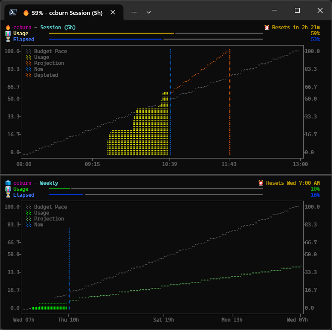

# 🔥 ccburn

[](https://github.com/JuanjoFuchs/ccburn/actions/workflows/ci.yml)
[](https://github.com/JuanjoFuchs/ccburn/actions/workflows/release.yml)
[](https://www.npmjs.com/package/ccburn)
[](https://pypi.org/project/ccburn/)
[](https://pypi.org/project/ccburn/)
[](https://github.com/JuanjoFuchs/ccburn/releases)
[](https://winstall.app/apps/JuanjoFuchs.ccburn)
[](https://www.npmjs.com/package/ccburn)
[](https://pepy.tech/project/ccburn)
[](https://github.com/JuanjoFuchs/ccburn/releases)
[](LICENSE)

<p align="center">
  
</p>

<p align="center">
  <strong>Watch your tokens burn — before you get burned.</strong>
</p>

TUI and CLI for Claude Code usage limits — burn-up charts, compact mode for status bars, JSON for automation.

<p align="center">
  
</p>

## Features

- **Real-time burn-up charts** — Visualize session, weekly, and monthly usage with live-updating terminal graphics
- **Pace indicators** — 🧊 Cool. 🔥 On pace. 🚨 Too hot.
- **Multiple output modes** — Full TUI, compact single-line for status bars, or JSON for scripting
- **Statusline integration** — `ccburn collect` pipes into your Claude Code statusline for zero-API-call data
- **Multi-profile support** — Isolated data per Claude Code profile via `CLAUDE_CONFIG_DIR`
- **Automatic data persistence** — SQLite-backed history for trend analysis
- **Agent-friendly** — `ccburn describe` outputs structured JSON for AI agents to auto-configure
- **Zoom views** — Focus on recent activity with `--since` / `--until`

## Installation

Run `claude` and login first to refresh credentials.

### WinGet (Windows)

```powershell
winget install JuanjoFuchs.ccburn
```

### npx

```bash
npx ccburn
```

### npm

```bash
npm install -g ccburn
```

### pip

```bash
pip install ccburn
```

### From Source

```bash
git clone https://github.com/JuanjoFuchs/ccburn.git
cd ccburn
pip install -e ".[dev]"
```

## Quick Start

1. **Run Claude Code first** to ensure credentials are fresh:
   ```bash
   claude
   ```
2. **Run ccburn:**
   ```bash
   ccburn                # Auto-detect best available data
   ccburn session        # 5-hour rolling session limit
   ccburn weekly         # 7-day weekly limit
   ccburn monthly        # Monthly credits (enterprise)
   ```

### Recommended: Statusline Integration

Add `ccburn collect` to your Claude Code statusline for the best experience — zero API calls, no rate limits, works with all profiles:

```json
// In ~/.claude/settings.json
{
  "statusLine": {
    "command": "ccburn collect | your-existing-statusline-command"
  }
}
```

`ccburn collect` reads Claude Code's statusline JSON, saves usage data to a local database, and passes the JSON through unchanged — your existing statusline keeps working.

## Usage Examples

```bash
# Full TUI with burn-up chart (default)
ccburn

# Specific limit views
ccburn session         # 5-hour session
ccburn weekly          # 7-day weekly
ccburn monthly         # Monthly credits (enterprise)

# Compact output for tmux/status bars
ccburn --compact
# Output: Session: 🔥 45% (2h14m) | Weekly: 🧊 12% | Sonnet: 🧊 3%

# JSON output for scripting/automation
ccburn --json

# Zoom views
ccburn --since 30m                        # Last 30 minutes
ccburn --since 3d --until end             # Last 3 days through window end
ccburn --since start --until depleted     # Full window through projected depletion

# Single snapshot (no live updates)
ccburn --once

# Custom refresh interval (seconds)
ccburn --interval 10

# AI agent introspection
ccburn describe        # Structured JSON with setup instructions
```

## Multiple Profiles

If you run multiple Claude Code profiles with `CLAUDE_CONFIG_DIR`, each profile gets isolated data:

```bash
# Enterprise profile (default)
ccburn

# Personal profile
CLAUDE_CONFIG_DIR=~/.claude-personal ccburn
```

Each profile stores its history in a separate database (`~/.ccburn/`, `~/.ccburn-personal/`, etc.).

## Command Line Reference

```
Commands:
  ccburn                Auto-detect and display best available limit
  ccburn session        5-hour rolling session limit
  ccburn weekly         7-day weekly limit (all models)
  ccburn weekly-sonnet  7-day weekly limit (Sonnet only)
  ccburn monthly        Monthly credit usage (enterprise)
  ccburn collect        Statusline pipe: save usage data to DB, pass through
  ccburn describe       Output structured JSON for AI agents
  ccburn clear-history  Clear all stored usage history

Options:
  -i, --interval INT    Render interval in seconds [default: 5/30/60]
  -p, --poll-interval INT  API poll interval in seconds [default: 60]
  -s, --since TEXT      Time window (e.g., '30m', '2h', '7d', 'start')
  -u, --until TEXT      Display end: 'now', 'end', or 'depleted'
  -j, --json            Output JSON and exit
  -1, --once            Print once and exit (no live updates)
  -c, --compact         Single-line output for status bars
  -d, --debug           Show debug information and strategy used
  -v, --version         Show version and exit
  --help                Show this message and exit
```

## Pace Indicators

| Emoji | Status | Meaning |
|-------|--------|---------|
| 🧊 | Behind pace | Usage below expected budget — you have headroom |
| 🔥 | On pace | Usage tracking with expected budget |
| 🚨 | Ahead of pace | Usage above expected budget — slow down! |

## Chart Elements

| Element | Description |
|---------|-------------|
| **Budget Pace** | Diagonal line showing expected usage if you spend evenly across the window |
| **Usage** | Your actual usage over time (from historical snapshots) |
| **Projection** | Dotted line extending your current burn rate to project future usage |
| **Now** | Vertical line marking the current time |
| **Depleted** | Vertical line marking when you'll hit 100% at the current burn rate |

Use `--since start --until depleted` to see the full window through the projected depletion point.

## Requirements

- **Python 3.10+**
- **Claude Code** installed with valid credentials
- Terminal with Unicode support (for charts and emojis)

## How It Works

ccburn uses multiple strategies to get usage data, in priority order:

1. **Statusline cache** — Data from `ccburn collect` in the SQLite DB (recommended, zero API calls)
2. **OAuth API** — Direct call to `api.anthropic.com/api/oauth/usage` (may hit 429 rate limits)
3. **Claude Desktop cookies** — Decrypts cookies and calls the web API via `curl` (default profile only)
4. **DB history fallback** — Shows last known data with a staleness banner

It calculates:

- **Budget pace** — Where you "should" be based on time elapsed in the window
- **Burn rate** — How fast you're consuming your limit (linear regression)
- **Time to limit** — Estimated time until you hit 100% (if current rate continues)

Data is stored locally in SQLite for historical analysis and to minimize API calls.

## Troubleshooting

### "Credentials not found"

Ensure Claude Code is installed and you've logged in at least once:
```bash
claude  # This will prompt for login if needed
```

### Chart not displaying correctly

Ensure your terminal supports Unicode and has a monospace font with emoji support. Recommended terminals:
- **Windows**: Windows Terminal
- **macOS**: iTerm2, Terminal.app
- **Linux**: Kitty, Alacritty, GNOME Terminal

### Stale data indicator

If you see a yellow "Using cached data" banner, ccburn couldn't reach the API. It will continue showing cached data and retry automatically. Set up `ccburn collect` in your statusline to avoid this entirely.

### Debug mode

Use `--debug` to see which data strategy is being used and troubleshoot issues. Logs are also written to `~/.ccburn/ccburn.log`.

## Contributing

Contributions are welcome! Please feel free to submit a Pull Request.

## License

[MIT](LICENSE)

## Acknowledgments

- [Rich](https://github.com/Textualize/rich) — Beautiful terminal formatting
- [Plotext](https://github.com/piccolomo/plotext) — Terminal plotting
- [Typer](https://github.com/tiangolo/typer) — CLI framework
