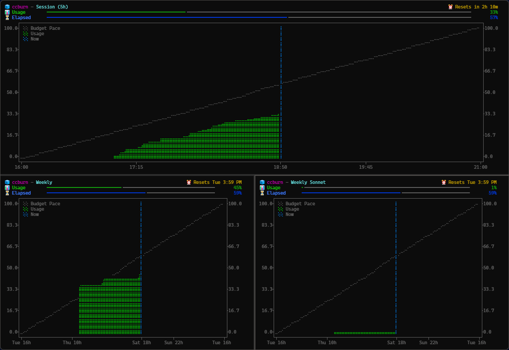

# 🔥 ccburn

[](https://github.com/JuanjoFuchs/ccburn/actions/workflows/ci.yml)
[](https://github.com/JuanjoFuchs/ccburn/actions/workflows/release.yml)
[](https://pypi.org/project/ccburn/)
[](https://pypi.org/project/ccburn/)
[](https://github.com/JuanjoFuchs/ccburn/releases)
[](https://github.com/microsoft/winget-pkgs/pulls?q=is%3Apr+ccburn)
[](LICENSE)

<p align="center">
  
</p>

<p align="center">
  <strong>Watch your tokens burn — before you get burned.</strong>
</p>

TUI and CLI for Claude Code usage limits — burn-up charts, compact mode for status bars, JSON for automation.



## Features

- **Real-time burn-up charts** — Visualize session and weekly usage with live-updating terminal graphics
- **Pace indicators** — 🧊 Cool. 🔥 On pace. 🚨 Too hot.
- **Multiple output modes** — Full TUI, compact single-line for status bars, or JSON for scripting
- **Automatic data persistence** — SQLite-backed history for trend analysis
- **Dynamic window title** — Terminal tab shows current usage at a glance
- **Zoom views** — Focus on recent activity with `--since`

## Installation

### Windows (WinGet) — *pending approval*

```powershell
winget install JuanjoFuchs.ccburn
```

### Cross-Platform (pip)

```bash
pip install ccburn
```

### From Source

```bash
git clone https://github.com/JuanjoFuchs/ccburn.git
cd ccburn
pip install -e ".[dev]"
```

## Quick Start

1. **Ensure Claude Code is installed** — ccburn reads credentials from Claude Code's config
2. **Run ccburn:**
   ```bash
   ccburn              # Session limit (default)
   ccburn weekly       # Weekly limit
   ccburn weekly-sonnet # Weekly Sonnet limit
   ```

## Usage Examples

```bash
# Full TUI with burn-up chart (default)
ccburn

# Weekly usage view
ccburn weekly

# Compact output for tmux/status bars
ccburn --compact
# Output: Session: 🔥 45% (2h14m) | Weekly: 🧊 12% | Sonnet: 🧊 3%

# JSON output for scripting/automation
ccburn --json

# Zoom to last 30 minutes
ccburn --since 30m

# Single snapshot (no live updates)
ccburn --once

# Custom refresh interval (seconds)
ccburn --interval 10
```

## Command Line Reference

```
Usage: ccburn [OPTIONS] [LIMIT]

Arguments:
  [LIMIT]  Which limit to display [default: session]
           Options: session, weekly, weekly-sonnet

Options:
  -i, --interval INTEGER  Refresh interval in seconds [default: 5/30]
  -s, --since TEXT        Only show data since (e.g., 30m, 2h, 1d)
  -j, --json              Output JSON and exit
  -o, --once              Print once and exit (no live updates)
  -c, --compact           Single-line output for status bars
  --debug                 Show debug information
  --version               Show version and exit
  --help                  Show this message and exit
```

## Pace Indicators

| Emoji | Status | Meaning |
|-------|--------|---------|
| 🧊 | Behind pace | Usage below expected budget — you have headroom |
| 🔥 | On pace | Usage tracking with expected budget |
| 🚨 | Ahead of pace | Usage above expected budget — slow down! |

## Requirements

- **Python 3.10+**
- **Claude Code** installed with valid credentials
- Terminal with Unicode support (for charts and emojis)

## How It Works

ccburn reads your Claude Code credentials and fetches usage data from the Anthropic API. It calculates:

- **Budget pace** — Where you "should" be based on time elapsed in the window
- **Burn rate** — How fast you're consuming your limit
- **Time to limit** — Estimated time until you hit 100% (if current rate continues)

Data is stored locally in SQLite for historical analysis and to minimize API calls when running multiple instances.

## Troubleshooting

### "Credentials not found"

Ensure Claude Code is installed and you've logged in at least once:
```bash
claude  # This will prompt for login if needed
```

### Chart not displaying correctly

Ensure your terminal supports Unicode and has a monospace font with emoji support. Recommended terminals:
- **Windows**: Windows Terminal
- **macOS**: iTerm2, Terminal.app
- **Linux**: Kitty, Alacritty, GNOME Terminal

### Stale data indicator

If you see "(stale)" in the header, ccburn couldn't reach the API. It will continue showing cached data and retry automatically.

## Contributing

Contributions are welcome! Please feel free to submit a Pull Request.

## License

[MIT](LICENSE)

## Acknowledgments

- [Rich](https://github.com/Textualize/rich) — Beautiful terminal formatting
- [Plotext](https://github.com/piccolomo/plotext) — Terminal plotting
- [Typer](https://github.com/tiangolo/typer) — CLI framework
